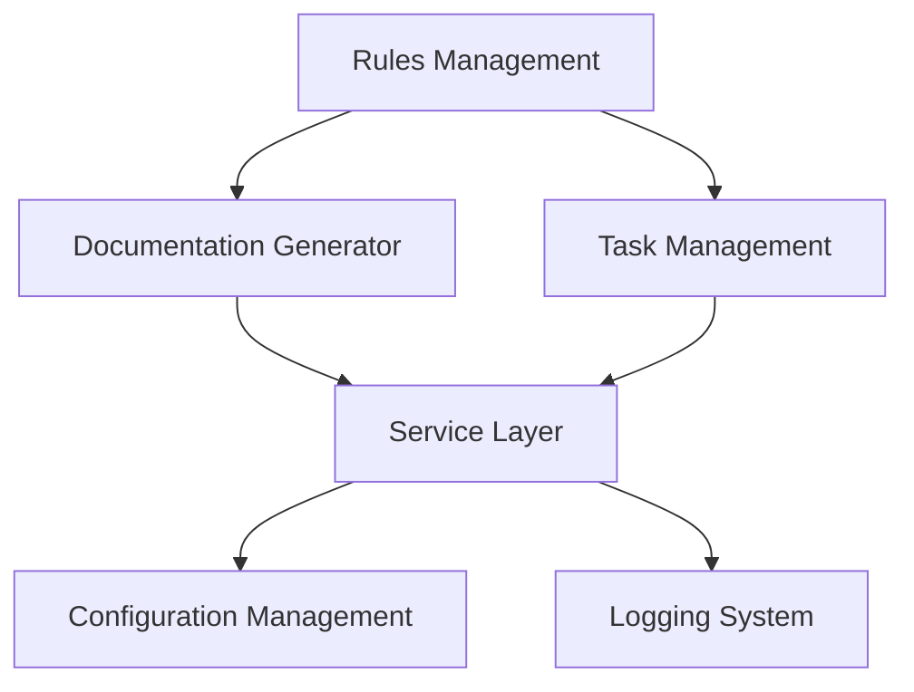

# System Architecture Document

## Overview

This document outlines the architecture of the development environment, which implements a rules management system, agile workflow, and automated documentation. The system is designed to enhance development consistency, automate tasks, and improve overall project management.

## System Components

### Core Systems

### 1. Rules Template System

- **Core Rules Engine**

  - Rule definition and validation
  - Rule application logic
  - Rule versioning system

- **Documentation Generator**
  - Markdown processing
  - Template rendering
  - Version control integration

### 2. Agile Workflow System

- **Task Management**

  - Task creation and tracking
  - Sprint planning
  - Backlog management

- **Workflow Automation**
  - Process automation
  - Status updates
  - Integration with version control

### 3. Service Layer

- **Service Container**
  - Service registration
  - Dependency injection
  - Lifecycle management

### 4. Configuration Management

- **Environment-based Config**
  - Config validation
  - Config versioning
  - Secret management

### 5. Logging System

- **Structured Logging**
  - Log levels
  - Log rotation
  - Log aggregation
  - Log analysis

### Supporting Systems

### 1. Integration Layer

- **Version Control Integration**

  - Git operations
  - Branch management
  - Commit tracking

- **IDE Integration**
  - Cursor IDE integration
  - Rule application
  - Code generation

### 2. Development Tools

- **Code Generation**
  - Refactoring tools
  - Code analysis
  - Performance profiling

### 3. Testing Framework

- **Unit Testing**
  - Integration testing
  - E2E testing
  - Test coverage

### 4. Security Features

- **Authentication**
- Authorization
- Audit logging
- Data encryption

## Component Interactions

## System Interactions

## Data Flow

1. Rule Definition -> Rule Application
2. Task Creation -> Workflow Processing
3. Documentation Updates -> Version Control Integration
4. IDE Actions -> Rule Application
5. Configuration Changes -> Service Layer
6. Logging Events -> Logging System

## Security Architecture

1. Access Control

   - User authentication
   - Permission management
   - Role-based access

2. Data Protection
   - Secure storage
   - Encryption
   - Backup systems

## Scalability Considerations

1. Horizontal Scaling

   - Component distribution
   - Load balancing
   - Resource management

2. Vertical Scaling
   - Resource optimization
   - Performance tuning
   - Capacity planning

## Monitoring and Maintenance

1. System Monitoring

   - Performance metrics
   - Error tracking
   - Usage statistics

2. Maintenance Procedures
   - Update protocols
   - Backup procedures
   - Recovery processes
