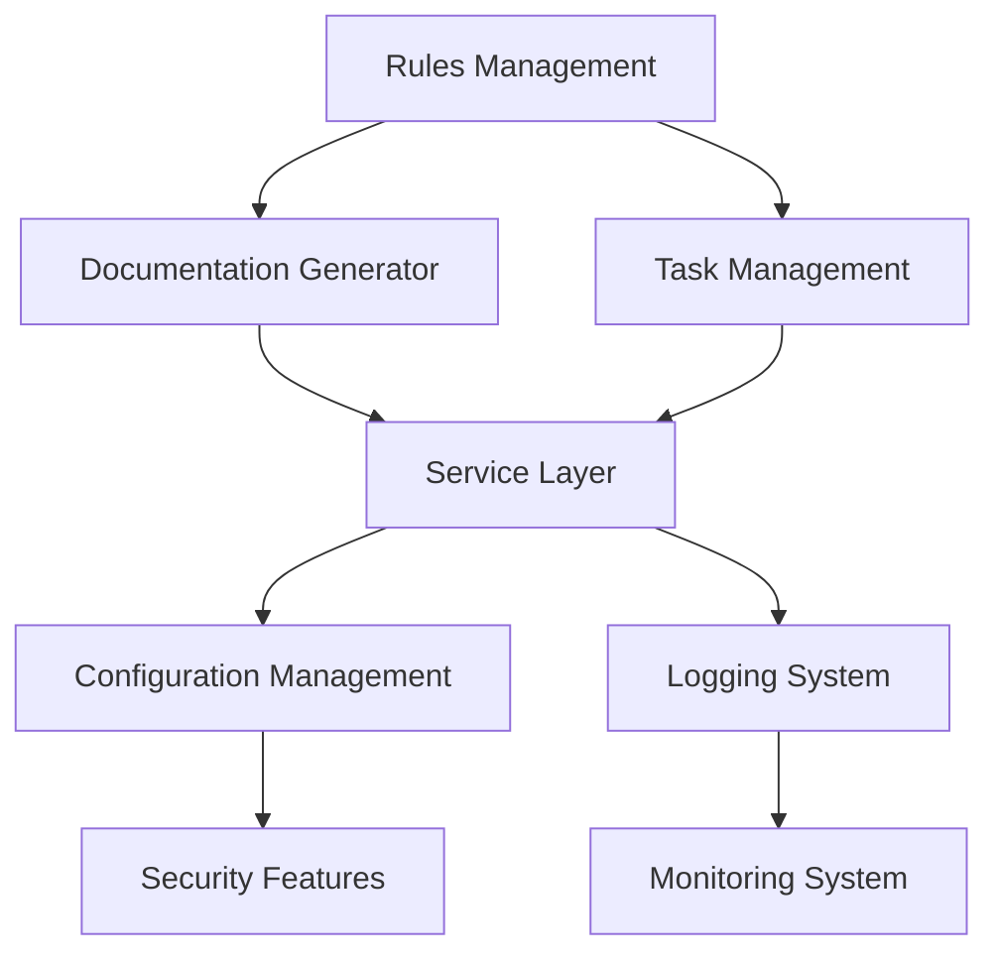

# Features Document

## Core Features

### 1. Rules Management System

**Description**: Core system for managing and applying development rules
**Priority**: High
**Status**: In Development

#### Specifications

- Rule definition and validation
- Rule application logic
- Rule versioning system
- Rule conflict resolution
- Rule inheritance and composition

#### Technical Requirements

- TypeScript-based rule engine
- JSON-based rule definitions
- Rule validation system
- Rule application pipeline
- Rule caching mechanism

### 2. Documentation Generator

**Description**: Automated documentation generation system
**Priority**: High
**Status**: Planned

#### Specifications

- Markdown processing
- Template rendering
- Version control integration
- Documentation validation
- Auto-update triggers

#### Technical Requirements

- Markdown parser
- Template engine
- Git integration
- Validation system
- Update detection

### 3. Task Management System

**Description**: Agile workflow task management
**Priority**: High
**Status**: Planned

#### Specifications

- Task creation and tracking
- Sprint planning
- Backlog management
- Task dependencies
- Progress tracking

#### Technical Requirements

- Task data model
- Sprint management
- Dependency graph
- Progress calculation
- Status updates

### 4. Service Layer

**Description**: Core service implementations
**Priority**: Medium
**Status**: Planned

#### Specifications

- Service registration
- Dependency injection
- Service lifecycle management
- Error handling
- Service monitoring

#### Technical Requirements

- Service container
- DI framework
- Lifecycle hooks
- Error boundaries
- Monitoring system

### 5. Configuration Management

**Description**: Application configuration system
**Priority**: High
**Status**: In Development

#### Specifications

- Environment-based config
- Config validation
- Config versioning
- Secret management
- Dynamic updates

#### Technical Requirements

- Config parser
- Validation system
- Version control
- Secret storage
- Update mechanism

### 6. Logging System

**Description**: Comprehensive logging solution
**Priority**: Medium
**Status**: In Development

#### Specifications

- Structured logging
- Log levels
- Log rotation
- Log aggregation
- Log analysis

#### Technical Requirements

- Log formatter
- Transport system
- Rotation handler
- Aggregation service
- Analysis tools

## Supporting Features

### 1. Development Tools

**Description**: Developer productivity tools
**Priority**: Medium
**Status**: Planned

#### Specifications

- Code generation
- Refactoring tools
- Code analysis
- Performance profiling
- Debugging tools

#### Technical Requirements

- Code generator
- AST parser
- Analysis engine
- Profiler
- Debugger

### 2. Testing Framework

**Description**: Comprehensive testing solution
**Priority**: High
**Status**: Planned

#### Specifications

- Unit testing
- Integration testing
- E2E testing
- Test coverage
- Test reporting

#### Technical Requirements

- Test runner
- Mock system
- Coverage tool
- Report generator
- Test automation

### 3. Security Features

**Description**: Security and compliance features
**Priority**: High
**Status**: Planned

#### Specifications

- Authentication
- Authorization
- Audit logging
- Data encryption
- Compliance checks

#### Technical Requirements

- Auth system
- RBAC
- Audit system
- Encryption
- Compliance validator

### 4. Monitoring System

**Description**: Application monitoring
**Priority**: Medium
**Status**: Planned

#### Specifications

- Performance metrics
- Health checks
- Alerting
- Dashboard
- Reporting

#### Technical Requirements

- Metrics collector
- Health checker
- Alert system
- Dashboard UI
- Report generator

## Feature Dependencies

## Implementation Timeline

### Phase 1: Core Foundation

1. Rules Management System
2. Configuration Management
3. Logging System

### Phase 2: Essential Features

1. Documentation Generator
2. Task Management System
3. Service Layer

### Phase 3: Supporting Features

1. Development Tools
2. Testing Framework
3. Security Features

### Phase 4: Enhancement

1. Monitoring System
2. Performance Optimization
3. User Experience Improvements
